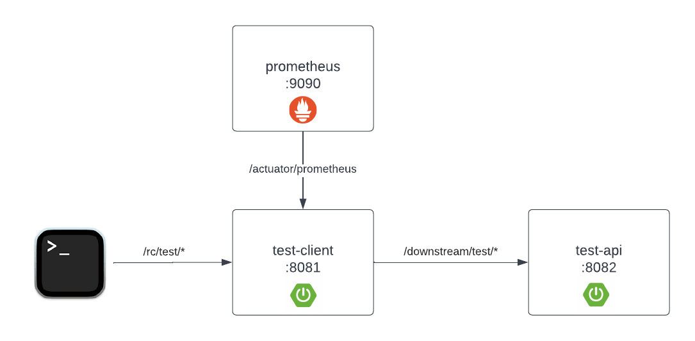

# Spring Http Client Demo

This repo contains two projects: 
* `test-api` - simple Spring Boot servlet based app to act as a "Downstream API"
* `test-client` - Spring Boot servlet based app with multiple Http Client configurations to consume 'test-api'

The below diagram depicts the setup (Running Prometheus is optional)



## Setup

1. Clone this repo
2. Start `test-api` in one terminal window
   ```
   cd test api
   ./gradlew bootRun
   ```
3. Start `test-client` in another terminal window
   ```
   cd test-client
   ./gradlew bootRun
   ```
4. (Optional) Start Prometheus, see [below](#prometheus-setup) for more info
5. Run a test, samples below (the later 2 require [autocannon](https://github.com/mcollina/autocannon))
    * Single Request: `curl localhost:8081/rc/test/0`
    * Parallel Requests: `./parallel.sh 2` - send two parallel requests
    * Load test: `./load-test.sh`

### Prometheus setup

1. Download [Prometheus](https://prometheus.io/download/) for your OS. 
2. Update `prometheus.yml` - adding a snippet in the `scrape_configs` to scrape from the Prometheus Actuator in the config file:
    ```yaml
    scrape_configs:
    - job_name: 'spring boot scrape'
        metrics_path: '/actuator/prometheus'
        scrape_interval: 5s
        static_configs:
        - targets: ['localhost:8081']
    ```
3. Start prometheus
4. Load Console: http://localhost:9090/targets - make sure you see 'spring boot scrape'